# UI reference — screens, menu structure, controls

Living description of what the slider's display actually shows, kept in sync with
`firmware/src/display.cpp` (drawing) and `firmware/src/menu.cpp` (navigation). The
screenshots in `docs/ui/` are generated from the same geometry, palette, glyph bitmaps and
status-bar icons the firmware uses — they are not mockups.

> **For the designer:** every image in `docs/ui/` is a 1:1 PNG at the panel's native
> 160×128. View them scaled by an integer factor (2×/4×/8×) with nearest-neighbour
> filtering; smoothing will misrepresent how this looks on the real screen. Constraints and
> known rough edges are listed in [Notes for redesign](#notes-for-redesign).

---

## 1. The canvas

| Property | Value |
|---|---|
| Panel | ST7735, **160×128**, landscape (`setRotation(1)`) |
| Colour depth | RGB565 (16-bit) |
| Font | Adafruit GFX classic 5×7 glyph in a **6×8 cell** — no other font is loaded |
| Text sizes in use | 1 (6×8 px/char), 2 (12×16), 3 (18×24) |
| Refresh | ~10 Hz, and only when something changed |
| Backlight | PWM, user-adjustable 10–100 % |

Because the only font is a 6 px-wide bitmap, **text width is always `chars × 6 × size`
pixels**. That gives hard limits worth designing against:

| Text size | Chars per full width (160 px) |
|---|---|
| 1 | 26 |
| 2 | 13 |
| 3 | 8 |

### Standard layout bands

Nearly every screen is built from three bands:

```
y=0    ┌──────────────────────────────┐
       │ status bar (12 px)           │  BG_PANEL + 1 px DIVIDER underneath
y=12   ├──────────────────────────────┤
       │                              │
       │ content (104 px)             │  BG_BASE
       │                              │
y=116  ├──────────────────────────────┤
       │ button hints (12 px)         │  BG_PANEL + 1 px DIVIDER on top
y=128  └──────────────────────────────┘
```

The status bar shows a Bluetooth icon (left, 12×12), the title `Camera Slider`, and a
battery icon (right, 12×12). List-style screens replace the title band with the screen's
own name and drop the Bluetooth/battery icons.

---

## 2. Controls

Three physical inputs. **BTN1 and BTN2 sit on the left flank of the enclosure, the encoder
on the right** — which is why the hint bar groups both button hints on the left and the
encoder hint on the right, rather than spreading them left/middle/right.

| Hint bar notation | Input |
|---|---|
| `1:` | BTN1, short press |
| `2:` | BTN2, short press |
| `(o)` | Encoder press |

Rotation is never shown in the hint bar — it is always "adjust the thing on screen".

General rules, unless a screen overrides them:

- **BTN1** — back one level / cancel.
- **BTN2** — jump to the main screen. Held for 800 ms — start homing (via a confirm dialog).
- **Encoder rotate** — change the value or move the selection; **press** — confirm/select.

One detent of the encoder equals one step. (The quadrature decoder counts four transitions
per detent and divides them down; sub-detent jitter never reaches the UI.)

---

## 3. Screen map

```
MAIN ─┬─ (o) ──────────────► GO TO POSITION ──► (back to MAIN)
      ├─ 2 ────────────────► MENU
      └─ 2 held ───────────► HOMING CONFIRM ──► CALIBRATION

MENU (2×2 tiles)
 ├─ Manual Move  ─────────► MANUAL MOVE
 ├─ Position     ─────────► GO TO POSITION
 ├─ Calibration  ─────────► CALIBRATION
 └─ Settings     ─────────► SETTINGS
                             ├─ Motion    ──► speed / ramp / microsteps /
                             │                endstop mode / homing speed   → VALUE EDIT
                             ├─ Sleep     ──► sleep timeout / ADXL sensitivity → VALUE EDIT
                             ├─ System    ──► motor current / reset calibration /
                             │                reset error / theme / brightness → VALUE EDIT
                             │                ├─ Diagnostics ──► DIAGNOSTICS
                             │                └─ Motor Test  ──► MOTOR TEST
                             └─ Wireless  ──► Bluetooth (On/Off)  → VALUE EDIT
                                              WiFi ──► WIFI MODE
                                                        ├─ Off
                                                        ├─ Connect ──► SCAN ──► PASSWORD ──► CONNECTING
                                                        └─ Hotspot ──► PASSWORD

ERROR      — entered automatically from any screen when a fault occurs
SLEEP      — backlight off entirely; nothing is drawn
OTA UPDATE — takes over the screen while firmware is being flashed over WiFi
```

---

## 4. Screens

### 4.1 Main

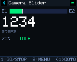

The default screen. Big number is the current position in steps; the bar above it shows
where the carriage is between the two endstops (`E1` … `E2`), animated with easing.

| Input | Action |
|---|---|
| Rotate | Speed 1–100 % |
| Press | Open Go to Position |
| BTN1 | Start / stop movement in the last direction |
| BTN2 | Open the menu |
| BTN2 held | Start homing (via confirm) |

States shown in the status line, each with its own colour: `IDLE` (green), `MOVING` /
`GO TO` (cyan), `HOMING` / `PARKING` (amber), `ERROR` (red), `SLEEP` (dim).

| Moving | Not calibrated |
|---|---|
| 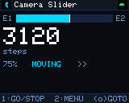 | 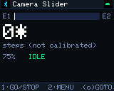 |

While moving, a direction marker (`>>` / `<<`) appears and the position bar turns cyan.
Until the slider has been homed, the position is suffixed with `*` and the bar stays empty
— travel is unknown, so there is nothing to show a fraction of.

### 4.2 Menu

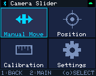

Four tiles in a 2×2 grid. Icons are drawn with primitives (not bitmaps) so they follow the
theme and the selection colour. Tile labels are capped at **13 characters** — the tile is
80 px wide.

| Input | Action |
|---|---|
| Rotate | Move between tiles (wraps) |
| Press | Open the tile |
| BTN1 / BTN2 | Back to main |

### 4.3 Manual Move

| Stopped | Running |
|---|---|
| 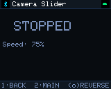 | 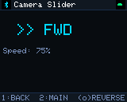 |

| Input | Action |
|---|---|
| Rotate | Speed, live |
| Press | Reverse direction (reverses on the fly if already moving) |
| BTN1 | Back to the menu |
| BTN2 | Main screen |

### 4.4 Go to Position

| Calibrated | Not calibrated |
|---|---|
| 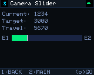 | 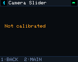 |

| Input | Action |
|---|---|
| Rotate | Target position, ~1 % of total travel per detent |
| Press | Start moving to the target |
| BTN1 | Back to wherever this was opened from |
| BTN2 | Main screen |

Without calibration the slider has no coordinate system, so the screen offers nothing but
a warning.

### 4.5 Calibration / homing

| Idle | Homing in progress |
|---|---|
| 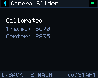 | 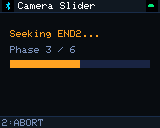 |

Homing runs in six phases (seek END1 → back off → seek END2 → back off → centre → done),
shown as a phase name and an amber progress bar. During homing every control is locked
except **BTN2 held = abort**; the measured travel and centre are stored afterwards.

### 4.6 Settings

| Settings | Motion | Sleep |
|---|---|---|
| 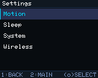 | 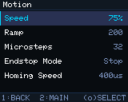 | 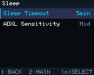 |

| System | Wireless |
|---|---|
| 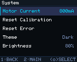 | 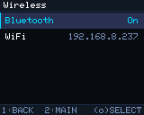 |

All settings screens share one list widget: 18 px rows, label left, current value right,
selected row filled with the highlight colour and marked with a 1 px accent bar on the left
edge. **Five rows fit at a time**; longer lists scroll (System has seven entries).

### 4.7 Value editor

| Numeric | Named options |
|---|---|
| 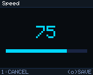 | 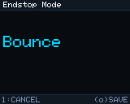 |

Numeric values are centred at text size 3 with a progress bar showing where the value sits
in its range. Named values (endstop mode, theme, ADXL sensitivity, Bluetooth on/off) use
size 2 and no bar — the longest name in use, `High Contrast`, is 13 characters and only
fits at that size.

| Input | Action |
|---|---|
| Rotate | Change value (microsteps step ×2 / ÷2) |
| Press | Save |
| BTN1 | Cancel |
| BTN2 | *Suppressed* — prevents discarding an edit by reflex |

### 4.8 Wireless

| WiFi mode | Scanning | Results |
|---|---|---|
| 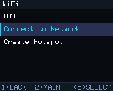 | 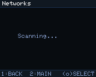 | 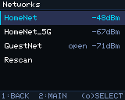 |

Open networks are labelled `open` next to their signal strength. The last row is always
`Rescan`.

**Password entry** — the encoder is the only text input, so characters are picked from a
74-character wheel:

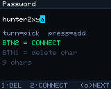

The cyan block is the cursor showing the pending character. Existing saved passwords are
pre-filled, so the common case is simply pressing BTN2.

| Input | Action |
|---|---|
| Rotate | Cycle the pending character |
| Press | Commit it and advance |
| BTN1 | Delete a character (cancels the screen when empty) |
| BTN2 | Submit (blocked for 1–7 characters: WPA2 needs at least 8) |

| Connecting | Failed |
|---|---|
| 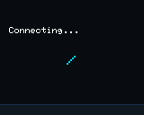 | 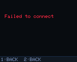 |

Connection attempts time out after 15 s.

### 4.9 Dialogs and system screens

| Homing confirm | Error |
|---|---|
| 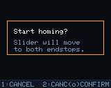 | 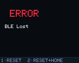 |

The error screen is entered automatically from any screen and its background pulses between
the base colour and dark red at 2.5 Hz. Errors: BLE connection lost, homing failed,
unexpected endstop.

**OTA update** — shown while firmware is flashed over WiFi. The main loop is fully blocked
during the transfer, so this screen is painted directly from the update callbacks:

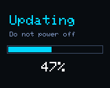

### 4.10 Service screens

Reached from Settings → System. Both suppress all normal navigation, so nothing can be
triggered by accident while probing hardware; **hold BTN1+BTN2 for 3 s to leave**.

| Diagnostics | Motor test |
|---|---|
| 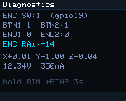 | 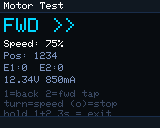 |

**Diagnostics** reads the GPIO pins directly, bypassing debouncing and the menu entirely,
so a dead switch can be told apart from a software fault. Both status LEDs mirror the
endstops here so they can be verified too.

**Motor test** jogs the motor on the bench: BTN1/BTN2 tap to run backward/forward, tapping
again (or the encoder press) stops, rotation sets speed live. Endstops are still respected.

---

## 5. Themes

Selectable in Settings → System → Theme, applied instantly and remembered.

| | Dark (default) | Light | High Contrast |
|---|---|---|---|
| Main |  | 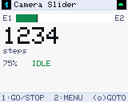 | 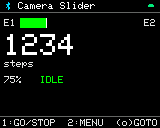 |
| Menu |  | 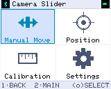 | 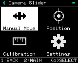 |
| System |  | 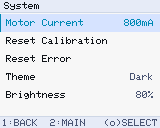 | 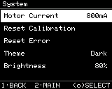 |

### Palette

Colours are RGB565. Note the display cannot show more than 5/6/5 bits per channel, so
fine gradients between near neighbours will band.

| Role | Dark | Light | High Contrast |
|---|---|---|---|
| `BG_BASE` — page background | `#0A0C14` | `#F4F6FA` | `#000000` |
| `BG_PANEL` — status/hint bars | `#111827` | `#E7ECF5` | `#000000` |
| `BG_CARD` — tiles, bar troughs | `#1C2540` | `#FFFFFF` | `#000000` |
| `BG_HIGHLIGHT` — selected row/tile | `#283255` | `#D6E4FF` | `#FFFFFF` |
| `COL_SEL` — selected text/border | `#00D4FF` | `#0088B3` | `#000000` |
| `COL_CYAN` — motion / active | `#00D4FF` | `#0088B3` | `#00FFFF` |
| `COL_GREEN` — idle / success | `#00E87A` | `#128A4A` | `#00FF00` |
| `COL_AMBER` — homing / warning | `#FFA020` | `#B36B00` | `#FFEA00` |
| `COL_RED` — error / endstop hit | `#FF2840` | `#C81E3A` | `#FF0000` |
| `TEXT_PRI` — primary text | `#FFFFFF` | `#12141C` | `#FFFFFF` |
| `TEXT_SEC` — secondary text | `#7A90BB` | `#4A5670` | `#E6E6E6` |
| `TEXT_DIM` — hints, disabled | `#3A4A66` | `#8B96AC` | `#AAAAAA` |
| `DIVIDER` — 1 px rules | `#1E2E48` | `#D0D8E4` | `#666666` |

High Contrast deliberately **inverts the selection** (white block, black text) instead of
tinting it, because every accent there is already a saturated colour on black.

---

## 6. Notes for redesign

Things worth knowing before proposing changes — constraints first, then existing weak spots.

**Hard constraints**

1. **One bitmap font, three sizes.** There is no proportional font and no font scaling
   beyond integer multiples. Any type hierarchy must come from sizes 1/2/3, colour and
   spacing. Adding a font costs flash, and the build is at ~86 % of its partition.
2. **No transparency, no antialiasing.** Everything is hard-edged; overlapping elements
   must be composed by drawing order.
3. **Drawing is immediate, with no frame buffer.** There is no back buffer, so anything
   cleared is visibly blank until it is repainted. This is why the current design updates
   text in place (each glyph paints its own background) instead of clearing regions —
   a redesign that relies on large repainted areas will flicker.
4. **Icons should stay as line art.** Photographic/AI-rendered icons were tried first and
   were illegible at 32 px; they also cannot follow the theme. Drawn primitives can be
   recoloured per state and cost almost nothing.

**Known weak spots**

- **Status-bar icons carry their own black background.** They are RGB565 bitmaps whose
  background pixels are opaque black, so they show as a black square on the panel colour —
  visible in the light theme especially. They should be redrawn as primitives (like the
  menu icons) or regenerated with the panel colour baked in.
- **High Contrast flattens the tiles.** `BG_CARD` and `BG_BASE` are both pure black there,
  so unselected menu tiles have no visible boundary at all.
- **The hint bar is cramped.** Two button hints plus the encoder hint on a 26-character
  line means labels are abbreviated (`RESET+HOME` alone is 10 characters). Longer labels
  will overflow silently.
- **Mixed information density.** The service screens are deliberately dense text dumps,
  while the main screen is very sparse. They were designed at different times and do not
  share a visual system.
- **No transition animation.** Screens swap instantly. Only the position bar eases, and the
  spinner/error pulse animate.

**Regenerating the screenshots**

```bash
python3 tools/ui_preview/extract_assets.py       # only if the font or icons changed
cd tools/ui_preview && python3 -m http.server 8912
# open http://localhost:8912/ — screens render from the same code paths as the firmware
```

`tools/ui_preview/index.html` re-implements the Adafruit GFX primitives the firmware draws
with, so it must be updated alongside `display.cpp` for these images to stay truthful.
